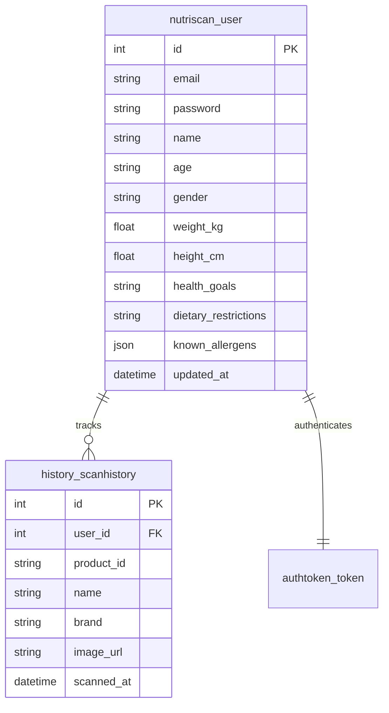
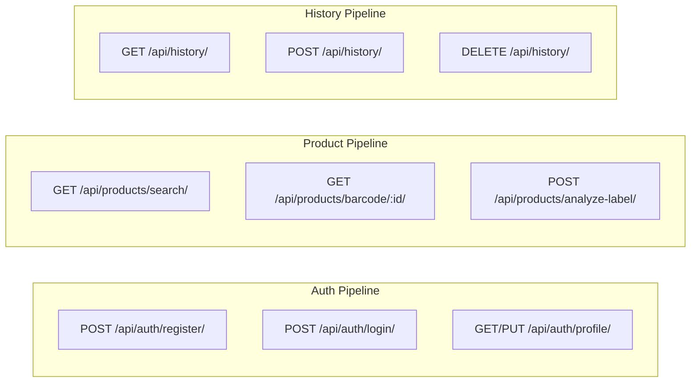

# Ingrevia — Ultimate User Manual & Codebase Guide

> **Official codebase guide for the Ingrevia / NutriScan application.**

Ingrevia is a cutting-edge mobile nutrition scanner built with **React Native (Expo)** and **Django REST Framework**. It enables users to snap photos of food packaging, scan barcodes, and receive instant personalized nutritional analyses powered by Google Gemini AI and Open Food Facts.

---

## Table of Contents
1. [🚀 Quickstart Setup (Clone to Launch)](#1-quickstart-setup-clone-to-launch)
2. [📂 Repository Map & File Index](#2-repository-map--file-index)
3. [⚙️ Environment Configuration](#3-environment-configuration)
4. [🏛️ Database Architecture](#4-database-architecture)
5. [📡 API Architecture & Endpoints](#5-api-architecture--endpoints)
6. [🔗 Networking: How The Stack Connects](#6-networking-how-the-stack-connects)

---

## 1. 🚀 Quickstart Setup (Clone to Launch)

Follow these exact steps to clone, install, configure, and run both layers of the application.

### 📋 Prerequisites
- **Python 3.11+** installed and added to PATH.
- **Node.js 20+** (LTS recommended) + **npm**.
- **Git** installed.
- Expo Go app installed on your physical mobile device (optional but recommended).

### 🛠️ Phase 1: Backend Configuration
1. Navigate to the backend directory:
   ```powershell
   cd backend
   ```
2. Create and activate a Python Virtual Environment:
   ```powershell
   # Windows
   python -m venv venv
   .\venv\Scripts\Activate.ps1
   
   # macOS / Linux
   python3 -m venv venv
   source venv/bin/activate
   ```
3. Install dependencies:
   ```bash
   pip install -r requirements.txt
   ```
4. Set up your local secrets:
   ```bash
   copy .env.example .env
   ```
   *Open `.env` and insert a valid `SECRET_KEY` and your `GOOGLE_API_KEY` (obtainable from Google AI Studio).*
5. Prepare the database:
   ```bash
   python manage.py migrate
   ```
6. Start the dev server (listens on all local IPs):
   ```bash
   python manage.py runserver 0.0.0.0:8000
   ```

### 🎨 Phase 2: Frontend Setup
1. Open a new terminal window and navigate to the frontend directory:
   ```bash
   cd FRONTEND
   ```
2. Install Node modules:
   ```bash
   npm install
   ```
3. Boot the Expo Metro Bundler:
   ```bash
   npx expo start
   ```
4. **Run the App**:
   - Press **`w`** to open the Web version in your browser.
   - Press **`a`** to launch Android Emulator (requires Android Studio).
   - **Scan the QR Code** using the **Expo Go app** on your physical iOS/Android device.

---

## 📂 Repository Map & File Index

This section is an exhaustive index explaining what every single file in the system does.

### 🖥️ Frontend Directory (`/FRONTEND`)
Runtime: Expo SDK 54, Typescript, File-based Routing.

#### `app/` — Screen Logic & Navigation
| File | Purpose |
|:---|:---|
| `index.tsx` | **Root / Splash**: Checks auth token state and handles immediate navigation logic. |
| `login.tsx` | Handles user authentication form submission via `AuthAPI`. |
| `register.tsx` | Handles user onboarding logic and creation workflows. |
| `scan.tsx` | Core scanner page controlling camera view, barcode extraction, and image selection. |
| `product-detail.tsx` | Generates the full nutritional breakdown, ingredients lists, and health ratings. |
| `error-screen.tsx` | Fallback screen for network failures with recursive state reloading. |
| `_layout.tsx` | App providers wrapper supplying Theme, Product, and Authentication global contexts. |
| `(tabs)/index.tsx` | **Home Screen**: Integrates recent scans feed, search bars, and hero components. |
| `(tabs)/profile.tsx` | Displays current profile stats (Age, Gender, Allergens) and application settings. |
| `(tabs)/_layout.tsx` | Bottom navigator configuration holding the active navigation stack. |

#### `components/` — Shared UI Controls
| File | Purpose |
|:---|:---|
| `SearchBar.tsx` | Global responsive text inputs with clearing controls. |
| `ProductCard.tsx` | Visually renders compact and expanded versions of scanned food item objects. |
| `NutriScoreBadge.tsx` | Conditional rendering component parsing A-E grading system for dynamic coloring. |
| `EmptyState.tsx` | Generic placeholder rendering utilized in empty searches and history queues. |
| `LogoBranding.tsx` | Maintains cohesive visual branding guidelines for authentication views. |

#### `constants/` — Config & Central State
| File | Purpose |
|:---|:---|
| `api.ts` | Centralized HTTP wrapper holding interfaces, bearer token injection, and payload parser logic. |
| `AuthContext.tsx` | Manages the singleton `User` object and explicit login/logout operations. |
| `ProductContext.tsx` | Shared memory space transferring selected items between listings and detail pages. |
| `ThemeContext.tsx` | Manages current Dark/Light visual state settings. |
| `config.ts` | Auto-resolvers ensuring the correct API URI is determined between LAN vs Prod nodes. |

#### `utils/` & `hooks/`
| File | Purpose |
|:---|:---|
| `productMapper.ts` | Strictly typed mapper casting external API dictionaries into frontend runtime structs. |
| `useSearch.ts` | Encapsulates query lifecycle, pagination throttling, and debounced caching. |
| `useHistory.ts` | Wraps explicit API history fetching allowing cross-component refreshing. |

---

### ⚙️ Backend Directory (`/backend`)
Runtime: Django 5, Python 3.11, Django REST Framework (DRF).

#### `nutriscan/` — Project Settings
| File | Purpose |
|:---|:---|
| `settings.py` | Core config defining database backends, middleware order, application pipelines. |
| `urls.py` | Global router mapping root requests to the local Application routers (`/api/...`). |

#### `users/` — Authentication Layer
| File | Purpose |
|:---|:---|
| `models.py` | Extends `AbstractUser` injecting personalized health, dietary, and allergic constraints. |
| `serializers.py` | Translates memory models into JSON strings enforcing dynamic field generation. |
| `views.py` | Explicit route implementations handling Registration, JWT-like creation, and Profile editing. |

#### `products/` — Processing Layer
| File | Purpose |
|:---|:---|
| `views.py` | High-level views orchestrating proxy logic between the device, AI services, and OFF dataset. |
| `ai_service.py` | Wrapper around Google Gemini generating strictly structured model requests. |
| `prompts.py` | Explicit string prompt templates engineering precise JSON formats from AI vision scans. |

#### `history/` — Logging Layer
| File | Purpose |
|:---|:---|
| `models.py` | Defines relational persistence for keeping track of user interaction history. |
| `views.py` | Houses unique-together logic handling automatic history refreshes during repeat views. |

---

## 🏛️ Database Architecture

The persistent data layer dictates how User states interact with historical tracking.

### 📊 Entity Relationship Diagram (ERD)
The following represents the relational constraints enforced within SQL storage:



### 📋 Table Schemas

#### 1. Users Table (`nutriscan_user`)
| Field | Type | Constraint / Description |
|:---|:---|:---|
| `id` | BigAutoField | **PK** |
| `email` | EmailField | Unique credentials utilized for User Auth. |
| `password` | CharField | Strongly hashed hash digest. |
| `name` | CharField(150) | Required user preferred display string. |
| `gender` | CharField(20) | Optional demographic discriminator. |
| `dietary_restrictions` | CharField(500) | Delimited token list (`vegan,dairy-free`). |
| `known_allergens` | JSONField | Native array structure storing sensitive health items. |
| `updated_at` | DateTimeField | Auto-populated write stamp. |

#### 2. Scan History Table (`history_scanhistory`)
| Field | Type | Constraint / Description |
|:---|:---|:---|
| `id` | BigAutoField | **PK** |
| `user_id` | ForeignKey | References User (Cascade deletes on account purge). |
| `product_id` | CharField(100) | Stores external lookup keys (Barcodes). |
| `name` | CharField(500) | Product title snapshot. |
| `image_url` | URLField(1000) | Direct image cache pointer. |
| `scanned_at` | DateTimeField | Write-enabled date marker. |

> **Constraints enforced at database layer:** A Composite Unique Key exists on `(user_id, product_id)` ensuring user scan history always reflects update frequency without duplication.

---

## 📡 API Architecture & Endpoints

Interaction flows entirely through explicit RESTful API transaction patterns secured by Header Tokens.

### Map of Available Handlers


#### Highlighted Data Structures
The system utilizes a standard **Normalized Product Schema** resulting from aggregated backend parsing:
```json
{
  "id": "8901058002157",
  "name": "Dark Chocolate",
  "brand": "BrandName",
  "allergens": ["milk", "nuts"],
  "nutriscore_grade": "c",
  "nutrients_100g": {
     "energy_kcal": 520.5,
     "proteins": 8.2,
     "fat": 31.4
  }
}
```

---

## 🔗 Networking: How The Stack Connects

### Development Handshake (Automatic Detection)
1. Expo’s Metro Server boots locally (ex: `192.168.1.5:8081`).
2. The mobile client queries the Metro configuration to retrieve its parent LAN IP address automatically.
3. `constants/config.ts` redirects backend traffic directly to the exact same IP on port `:8000`.
4. **Result**: No IP editing required when switching wifi networks.

### Cross-Origin Resource Sharing (CORS)
- **Local Mode (`DEBUG=True`)**: Backend universally accepts connections to streamline simulator testing across virtual hardware bridges.
- **Production Mode (`DEBUG=False`)**: Tight whitelist is strictly enforced via `.env` variable `FRONTEND_URL`.

---

## 📂 Portable Files Warning
Ensure the following sensitive or auto-generated elements NEVER enter source control tracking:
- `backend/venv/`
- `FRONTEND/node_modules/`
- `backend/.env`
- `backend/db.sqlite3`
- `FRONTEND/.env`

*(Refer to `.gitignore` mappings for details.)*

---
**Ingrevia Application User Manual V1.0**  

