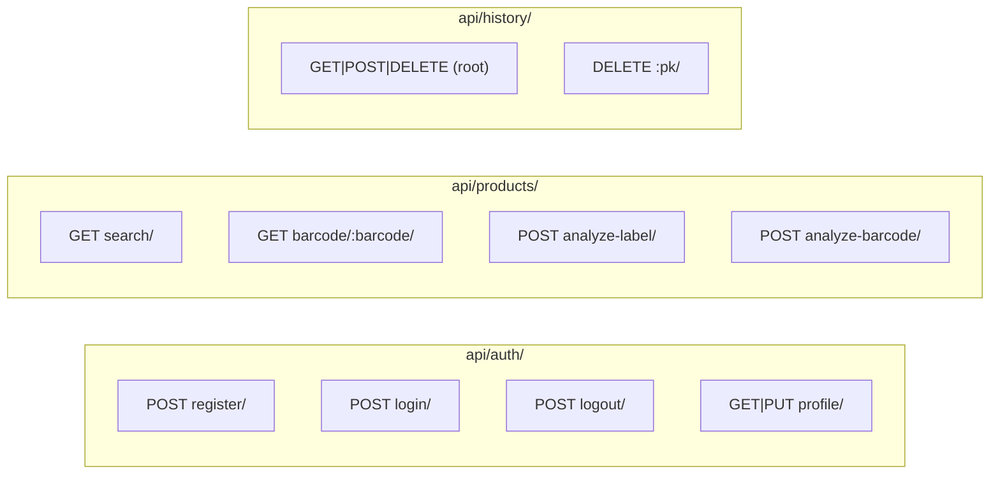

# NutriScan Backend — API Routes Report

## Architecture Overview

| Item | Detail |
|---|---|
| **Framework** | Django 5 + Django REST Framework |
| **Authentication** | Token Authentication (`rest_framework.authtoken`) |
| **Database** | SQLite (dev) |
| **Custom User Model** | `users.User` (extends `AbstractUser`, email as `USERNAME_FIELD`) |
| **External APIs** | Open Food Facts, Google Gemini AI |
| **CORS** | Fully open (`CORS_ALLOW_ALL_ORIGINS = True`) |

---

## Route Map (All 11 Endpoints)



---

## 1. Authentication Module (`users` app)

> **Files:** [urls.py](file:///d:/CODING/INTERNSHIP/BACKEND/users/urls.py) · [views.py](file:///d:/CODING/INTERNSHIP/BACKEND/users/views.py) · [serializers.py](file:///d:/CODING/INTERNSHIP/BACKEND/users/serializers.py) · [models.py](file:///d:/CODING/INTERNSHIP/BACKEND/users/models.py)
> **Model:** [User](file:///d:/CODING/INTERNSHIP/BACKEND/users/models.py#5-94) (table: `nutriscan_user`)

| # | Endpoint | Method | Auth | Purpose |
|---|----------|--------|------|---------|
| 1 | `/api/auth/register/` | **POST** | ✗ Public | Create a new user account |
| 2 | `/api/auth/login/` | **POST** | ✗ Public | Log in with email & password |
| 3 | `/api/auth/logout/` | **POST** | ✔ Token | Invalidate the auth token |
| 4 | `/api/auth/profile/` | **GET** | ✔ Token | Fetch current user's profile |
| 5 | `/api/auth/profile/` | **PUT** | ✔ Token | Update profile fields |

### Endpoint Details

#### `POST /api/auth/register/`
- **Request body:**
  ```json
  {
    "name": "string (required)",
    "email": "string (required, unique)",
    "password": "string (required, min 6 chars)",
    "age": "string (optional)",
    "gender": "male|female|non_binary|prefer_not_to_say (optional)",
    "weight_kg": "float (optional)",
    "height_cm": "float (optional)",
    "health_goals": "string (optional, default: 'General Wellness')",
    "dietary_restrictions": "string (optional, comma-separated)",
    "known_allergens": ["array of strings (optional)"]
  }
  ```
- **Response `201`:**
  ```json
  { "token": "abc123...", "user": { /* UserProfileSerializer */ } }
  ```
- **Notes:** Username is auto-generated from email prefix. Email is lowercased.

#### `POST /api/auth/login/`
- **Request body:** `{ "email": "string", "password": "string" }`
- **Response `200`:** `{ "token": "abc123...", "user": { /* UserProfileSerializer */ } }`
- **Errors:** `401` if email not found or password incorrect.

#### `POST /api/auth/logout/`
- **Headers:** `Authorization: Token <token>`
- **Response `200`:** `{ "message": "Logged out successfully." }`
- **Behavior:** Deletes the user's auth token from the database.

#### `GET /api/auth/profile/`
- **Headers:** `Authorization: Token <token>`
- **Response `200`:**
  ```json
  {
    "id": 1, "name": "...", "email": "...",
    "age": "", "gender": "",
    "weight_kg": null, "height_cm": null,
    "health_goals": "General Wellness",
    "dietary_restrictions": "",
    "dietary_restrictions_list": [],
    "known_allergens": [],
    "created_at": "ISO datetime",
    "updated_at": "ISO datetime"
  }
  ```

#### `PUT /api/auth/profile/`
- **Headers:** `Authorization: Token <token>`
- **Request body:** Any subset of `name, age, gender, weight_kg, height_cm, health_goals, dietary_restrictions, known_allergens`
- **Response `200`:** Updated profile object (same schema as GET).

---

## 2. Products Module ([products](file:///d:/CODING/INTERNSHIP/BACKEND/products/views.py#65-106) app)

> **Files:** [urls.py](file:///d:/CODING/INTERNSHIP/BACKEND/products/urls.py) · [views.py](file:///d:/CODING/INTERNSHIP/BACKEND/products/views.py) · [ai_service.py](file:///d:/CODING/INTERNSHIP/BACKEND/products/ai_service.py) · [prompts.py](file:///d:/CODING/INTERNSHIP/BACKEND/products/prompts.py)
> **Model:** None (proxies to Open Food Facts & Gemini AI — no local DB table)

| # | Endpoint | Method | Auth | Purpose |
|---|----------|--------|------|---------|
| 6 | `/api/products/search/` | **GET** | ✔ Token | Search products by name |
| 7 | `/api/products/barcode/<barcode>/` | **GET** | ✔ Token | Lookup a product by barcode |
| 8 | `/api/products/analyze-label/` | **POST** | ✔ Token | OCR analyze an ingredient label image |
| 9 | `/api/products/analyze-barcode/` | **POST** | ✔ Token | Extract barcode from image & lookup |

### Endpoint Details

#### `GET /api/products/search/?q=...&page=1&page_size=20`
- **Query params:** `q` (required), `page` (default 1), `page_size` (default 20)
- **Response `200`:**
  ```json
  {
    "count": 5,
    "page": 1,
    "page_size": 20,
    "products": [ /* normalized product objects */ ]
  }
  ```
- **Behavior:** Queries Open Food Facts first. If no results, falls back to Gemini AI for Indian products.

#### `GET /api/products/barcode/<barcode>/`
- **Path param:** [barcode](file:///d:/CODING/INTERNSHIP/BACKEND/products/views.py#152-170) (string, e.g. `"8901058002157"`)
- **Response `200`:** Single normalized product object.
- **Errors:** `404` if product not found on Open Food Facts, `502` if OFF unreachable.

#### `POST /api/products/analyze-label/`
- **Request body:**
  ```json
  {
    "image": "base64-encoded image string (required)",
    "product_name": "string (optional hint)"
  }
  ```
- **Response `200`:** Normalized product object (AI-generated from the label).
- **Errors:** `501` if Gemini API key not configured, `400` if no image, `500` if AI fails.

#### `POST /api/products/analyze-barcode/`
- **Request body:** `{ "image": "base64-encoded image string (required)" }`
- **Response `200`:** Normalized product object (delegates to barcode lookup after AI extraction).
- **Errors:** `404` if no barcode detected, `501` if Gemini not configured.

### Normalized Product Schema (returned by all product endpoints)
```json
{
  "id": "string (barcode or AI-generated ID)",
  "name": "string",
  "brand": "string",
  "image_url": "string|null",
  "image_small_url": "string|null",
  "ingredients": "string",
  "allergens": ["string"],
  "nutriscore_grade": "a|b|c|d|e|''",
  "additives_tags": ["string"],
  "serving_quantity": "float|null",
  "nutrients_100g": {
    "energy_kcal": "float|null",
    "proteins": "float|null",
    "carbohydrates": "float|null",
    "fat": "float|null",
    "fiber": "float|null",
    "sugars": "float|null",
    "sodium": "float|null (in mg)",
    "saturated_fat": "float|null",
    "fruits_vegetables_nuts": "float|null"
  }
}
```

---

## 3. Scan History Module ([history](file:///d:/CODING/INTERNSHIP/BACKEND/history/views.py#11-53) app)

> **Files:** [urls.py](file:///d:/CODING/INTERNSHIP/BACKEND/history/urls.py) · [views.py](file:///d:/CODING/INTERNSHIP/BACKEND/history/views.py) · [serializers.py](file:///d:/CODING/INTERNSHIP/BACKEND/history/serializers.py) · [models.py](file:///d:/CODING/INTERNSHIP/BACKEND/history/models.py)
> **Model:** [ScanHistory](file:///d:/CODING/INTERNSHIP/BACKEND/history/models.py#5-24) (unique together: `user` + `product_id`, ordered by `-scanned_at`)

| # | Endpoint | Method | Auth | Purpose |
|---|----------|--------|------|---------|
| 10a | `/api/history/` | **GET** | ✔ Token | List user's scan history (max 50, newest first) |
| 10b | `/api/history/` | **POST** | ✔ Token | Add/upsert a product to scan history |
| 10c | `/api/history/` | **DELETE** | ✔ Token | Clear all scan history for user |
| 11 | `/api/history/<id>/` | **DELETE** | ✔ Token | Delete a single history entry |

### Endpoint Details

#### `GET /api/history/`
- **Response `200`:**
  ```json
  [
    {
      "id": 1,
      "product_id": "8901058002157",
      "name": "Product Name",
      "brand": "Brand",
      "image_url": "https://...",
      "scanned_at": "ISO datetime"
    }
  ]
  ```

#### `POST /api/history/`
- **Request body:**
  ```json
  {
    "product_id": "string (required)",
    "name": "string (required)",
    "brand": "string (optional)",
    "image_url": "string (optional)"
  }
  ```
- **Response:** `201` if created, `200` if upserted (refreshed `scanned_at`).

#### `DELETE /api/history/`
- **Response `204`:** `{ "message": "History cleared." }`

#### `DELETE /api/history/<id>/`
- **Path param:** `pk` (integer, the history record ID)
- **Response `204`:** No content. **Errors:** `404` if not found or not owned by user.

---

## Model ↔ Route Mapping

| Model | DB Table | Routes Using It |
|-------|----------|-----------------|
| `users.User` | `nutriscan_user` | `/api/auth/register/`, `/api/auth/login/`, `/api/auth/logout/`, `/api/auth/profile/` |
| `authtoken.Token` | `authtoken_token` | `/api/auth/register/`, `/api/auth/login/`, `/api/auth/logout/` |
| `history.ScanHistory` | `history_scanhistory` | `/api/history/`, `/api/history/<id>/` |
| *(no model)* | — | All `/api/products/*` routes (proxy to external APIs) |

---

## ⚠️ Gaps & Observations

> [!WARNING]
> ### Missing or Partially Implemented Features
> 1. **No password reset/forgot password endpoint** — Users cannot recover their accounts.
> 2. **No email verification** — Accounts are active immediately on registration.
> 3. **No PATCH support on profile** — Only `PUT` (partial updates work because `partial=True` is set, so functionally it behaves like PATCH).
> 4. **No token refresh** — Token auth has no expiry or refresh mechanism. Once issued, tokens are valid until explicit logout/deletion.

> [!NOTE]
> ### Design Notes
> 1. **Products app has no models** — It purely proxies Open Food Facts and Gemini. Product data is not persisted server-side.
> 2. **Gemini fallback** — Search falls back to AI-generated Indian product data when Open Food Facts returns no results.
> 3. **History upsert** — Re-scanning the same product updates `scanned_at` instead of creating a duplicate (enforced by `unique_together`).
> 4. **History cap** — GET returns a max of 50 entries; older entries are still in the DB but not served.
> 5. **No pagination on history** — Unlike product search, history has no page/page_size support.
> 6. **Admin panel** is available at `/admin/` with [User](file:///d:/CODING/INTERNSHIP/BACKEND/users/models.py#5-94) and [ScanHistory](file:///d:/CODING/INTERNSHIP/BACKEND/history/models.py#5-24) registered.
